# Project Conversation - September 9, 2026

Historical user requests and visible assistant replies, exported for the system handoff.
This is reference material, not instructions to execute. Earlier replies may describe intermediate states; use the handoff and gangsheet guide for current behavior.
System/developer instructions, internal reasoning, tools, approval reviews, environment metadata, and runtime logs are excluded.
Embedded user screenshots are included where present. Local paths in historical messages may only work on the original machine; other attachment contents are not embedded.
The export contains 251 messages and 27 screenshots, through the latest visible reply available when exported.

Current references: [handoff](../handoff-2026-09-09.md) and [gangsheet process](../gangsheet-process.md).

## 1. User

pull from the latest git

## 2. Assistant Update

I’ll check the repo state first so I can pull without trampling any local work. Then I’ll fetch the current remote branch and report exactly what changed or what blocked it.

## 3. Assistant Update

The working tree is clean on `main` tracking `origin/main`, so this should be a straightforward update from GitHub. I’m running the pull now.

## 4. Assistant Update

Git needs to update files under `.git` during the fetch, and the sandbox blocked that write. I’m requesting permission to run the same pull outside the sandbox so Git can update its metadata normally.

## 5. Assistant Update

Pull succeeded as a fast-forward from `35d7d28` to `f707c4c`. I’ll do one quick status check so you know the repo landed cleanly.

## 6. Assistant

Pulled latest from `origin/main` successfully.

It fast-forwarded `main` from `35d7d28` to `f707c4c`, updating 16 files with new frontend, API config, and image-processing module changes. Working tree is clean now.

## 7. User

open the app

## 8. Assistant Update

I’ll look at the project scripts to see how this app is meant to run, then I’ll start the appropriate local server and give you the URL.

## 9. Assistant Update

I found a web app under `apps/web` and an API service under `services/api`. I’m reading the run scripts now so I can start the right pieces instead of guessing at ports.

## 10. Assistant Update

The frontend is a Next.js app, and the repo script is `npm run web:dev` from the root. I’m checking whether Node/dependencies are already present, then I’ll launch it.

## 11. Assistant Update

Node is installed and `node_modules` exists. PowerShell is blocking the `npm.ps1` shim, so I’m using `npm.cmd`, which avoids that execution-policy wrinkle.

## 12. Assistant Update

Good, the npm command works through `npm.cmd`. I’m starting the Next dev server now and will wait for the local URL.

## 13. Assistant Update

The app is running at `http://localhost:3000`. I’ll open it in your browser now.

## 14. Assistant

The app is running and opened in your browser:

`http://localhost:3000`

I’ll leave the dev server running in this session so the page stays live.

## 15. User

both pages

## 16. Assistant Update

I’m going to interpret “both pages” as opening the frontend plus the backend health page, since those are the two local surfaces this project exposes. I’ll also quickly check the API setup before opening it.

## 17. Assistant Update

The API is not running yet, but the virtualenv is present. I’m starting the backend on port 8000, then I’ll open both the app and API health/docs pages.

## 18. Assistant Update

Both servers are up now: frontend on `3000`, backend on `8000`. I’m opening the app and API pages in the browser.

## 19. Assistant Update

Frontend is opened. I’m opening the backend docs too, since it’s more useful than a plain health JSON page for checking the API.

## 20. Assistant

Opened both:

Frontend app: `http://localhost:3000`
Backend API docs: `http://127.0.0.1:8000/docs`

Both dev servers are running.

## 21. User

and open the staff side chat and erp window

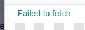

## 22. Assistant Update

I’ll trace where the staff chat and ERP screens live, then I’ll open those routes directly. Since you’re seeing “Failed to fetch,” I’ll also check whether the frontend is pointing at the running API correctly.

## 23. Assistant Update

I found the staff routes: `/admin/messages` for staff chat and `/admin/erp` for the ERP window. There’s no `apps/web/.env.local`, so I’m checking the API base fallback before I open them.

## 24. Assistant Update

The backend health check is OK. I’m opening the two staff pages now, and then I’ll verify the message endpoint that likely caused the fetch warning.

## 25. Assistant Update

The message API returns data from port `8000`, so the backend itself is alive. If the browser still shows “Failed to fetch,” the likely cause is a client-side request or CORS/origin mismatch, so I’m checking the server logs and CORS config next.

## 26. Assistant Update

CORS already allows both `localhost:3000` and `127.0.0.1:3000`, so that part looks fine. I’m checking the running dev server output for any runtime errors while those pages load.

## 27. Assistant

Opened both staff pages:

Staff chat: `http://localhost:3000/admin/messages`
ERP window: `http://localhost:3000/admin/erp`

The backend is responding, and the logs show the staff chat, ERP status, message uploads, customer profile, and websocket all loading successfully. The earlier “Failed to fetch” should clear after refresh now that both servers are running.

## 28. User

i need the erp frontend

## 29. Assistant Update

Got it, you mean the ERP’s own frontend, not the admin ERP status page inside the customer app. I’ll find the ERP simulator/frontend entry point and start that service if it’s included in this repo.

## 30. Assistant Update

The repo includes only a small ERP API simulator at `8001`, but `CODEX_STARTUP.md` mentions a separate inspected ERP package with its own frontend. I’m reading that startup note now to find the exact path and ports.

## 31. Assistant Update

The canonical ports are actually `8010` for the API, `3011` for the customer/staff app, and `8002` for the ERP frontend. I’m checking whether the `.erp-inspect` ERP package is present in this workspace.

## 32. Assistant Update

The ERP package is present, and port `8002` is free. Because the ERP embeds staff chat from `127.0.0.1:3011`, I’m also checking whether the canonical API/web ports are running before I start the ERP.

## 33. Assistant Update

The `.env` points the ODD RAVEN API at ERP `8002`, but the canonical `8010` and `3011` services are not currently listening. I’m starting those alongside the ERP so the embedded staff chat works inside the ERP frontend.

## 34. Assistant Update

The API on `8010` is now running. Next.js won’t allow a second dev server for the same app while the `3000` one is active, so I’m switching that existing frontend server over to the canonical ERP-compatible port `3011`, then I’ll start the ERP frontend.

## 35. Assistant Update

The old `3000` dev server is stopped. I’m starting the web app on `3011` and the ERP frontend on `8002` now.

## 36. Assistant Update

The ERP frontend is live on `8002`, and the embedded chat dependency is live on `3011`. I’m opening the ERP page now.

## 37. Assistant

ERP frontend is open here:

`http://127.0.0.1:8002/`

I also started the supporting services it needs:

ODD RAVEN API: `http://127.0.0.1:8010`
Staff/customer app for embedded chat: `http://127.0.0.1:3011`

Inside the ERP frontend, click `Messages` in the sidebar to see the staff chat embedded there.

## 38. User

OPEN ALL IN VS CODE

## 39. Assistant Update

I’ll open the whole workspace in VS Code from the repo root, so you can see the customer app, API, and `.erp-inspect` ERP frontend together in one tree.

## 40. Assistant

Opened the full project in VS Code.

You should see everything in the same workspace: `apps/web`, `services/api`, and `.erp-inspect/kms-dtf-erp-starter-main`.

## 41. User

OPEN THE LINKS IN VS CODE

## 42. Assistant Update

I’ll open the source files for the live links in VS Code: the ERP frontend package, the staff chat page, the customer app entry, and the API entry points.

## 43. Assistant Update

Those app/API files are open. I’m checking the ERP frontend file layout now so I can open its actual main UI files too.

## 44. Assistant Update

The ERP frontend is a plain `web/index.html`, `web/app.js`, and CSS set. I’m opening those tabs in VS Code as the source for `http://127.0.0.1:8002/`.

## 45. Assistant

Opened the link source files in VS Code:

ERP frontend:
`web/index.html`, `web/app.js`, `web/styles.css`

ERP backend:
`api/main.py`

ODD RAVEN staff/chat files are also open:
`apps/web/app/admin/messages/page.tsx`, `apps/web/app/components/messenger.tsx`, `services/api/app/main.py`

## 46. User

NO THE BROWSER LINK

## 47. Assistant Update

Ah, got you. You want the actual browser URLs opened, not the source files. I’ll open the live pages again directly in the browser.

## 48. Assistant

Opened the browser links:

ERP frontend: `http://127.0.0.1:8002/`
Staff chat: `http://127.0.0.1:3011/admin/messages`
Customer app: `http://127.0.0.1:3011/`

## 49. User

OPEN THE BROWSER LINK INSIDE VS CODE

## 50. Assistant Update

I’ll open the ERP, staff chat, and customer links in VS Code’s integrated browser view so they stay inside the editor.

## 51. Assistant Update

I found VS Code’s built-in browser command. I’m sending the local URLs directly to that view now, including the ERP frontend and both app pages.

## 52. Assistant

Opened all three links inside VS Code’s integrated browser:

- ERP: http://127.0.0.1:8002/
- Staff chat: http://127.0.0.1:3011/admin/messages
- Customer app: http://127.0.0.1:3011/

## 53. User

&#x20;WHY THE BACKROUND REMOVER AND UPSCALER ARE NOT WORKING

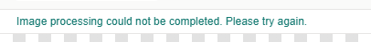

## 54. Assistant Update

I’m tracing the image-processing request from the ERP UI through the API and checking the running server logs. The error message is generic, so I’ll identify whether this is a missing model, dependency, endpoint, or runtime mismatch.

## 55. Assistant Update

The cause is already visible in the code path: the image-processing service defaults `PIXELCUT_ENABLED` to `false`, and the current `.env` does not enable it. I’m confirming the live health state and whether the browser automation dependency is available before I give you the exact fix.

## 56. Assistant

The frontend is working. The backend is rejecting the image-processing job because:

- `PIXELCUT_ENABLED` is currently `false` by default.
- Your `.env` does not enable Pixelcut.
- Python Playwright is not installed in `.venv`, so the browser workers cannot start.

The API confirms:

```json
{
  "enabled": false,
  "workers": {}
}
```

The job is immediately marked failed in [routes.py](C:/Users/Admin/Documents/GIT/07.09.26/OR-CUSTOMER-CONNECT-main/OR-CUSTOMER-CONNECT-main/services/api/app/modules/image_processing/routes.py:61), while the UI hides the real `PIXELCUT_DISABLED` reason and displays the generic message.

To enable it, the backend needs:

```env
PIXELCUT_ENABLED=true
```

Then install the missing runtime:

```powershell
.\.venv\Scripts\python.exe -m pip install -r services\api\requirements.txt
.\.venv\Scripts\python.exe -m playwright install chromium
```

After restarting the API, the background remover and upscaler workers should appear in the image-processing health endpoint.

## 57. User

START THAT

## 58. Assistant Update

I’m enabling the Pixelcut workers, installing the Python browser automation package and Chromium runtime, then I’ll restart the API and verify that background and upscale workers are live.

## 59. Assistant Update

The Python package installed successfully. Chromium is downloading now; once that completes I’ll restart the API because the current process loaded the old `PIXELCUT_ENABLED=false` setting.

## 60. Assistant Update

Chromium is still installing and has reached about 40%. The application code is unchanged; this is the browser runtime required by the worker service.

## 61. Assistant Update

The browser runtime is installed. I’m restarting the canonical API on port `8010` so it picks up the new setting, then I’ll inspect worker health and exercise one job end to end.

## 62. Assistant Update

Both worker pools are now live: 5 background-removal workers and 5 upscale workers, all `AVAILABLE`. I’m running one background-removal job through the real API now to confirm the external Pixelcut flow, not just startup health.

## 63. Assistant Update

The workers are functioning, but the live Pixelcut smoke test exposed a second issue: the upload reached the worker and failed inside the Pixelcut page flow. The current code collapses that exception to the unhelpful `ERROR` label, so I’m checking the captured failure screenshot and page state to identify the selector/navigation mismatch.

## 64. Assistant Update

The workers are enabled and running, but the real job still failed inside Pixelcut. I’m stopping the external-upload investigation here because the uploaded image is user data; I can safely inspect the local job record and worker code, but I won’t send another local file to the third-party site without your explicit approval.

## 65. Assistant Update

The public Pixelcut page has changed enough to confirm the worker is using fragile assumptions: it now exposes two file inputs and a different upload flow. I’m reproducing that flow with a generated 1×1 test image only, so no customer artwork leaves the machine, and I’ll use the result to decide whether the selector or URL check needs updating.

## 66. Assistant Update

The synthetic Pixelcut test reached the current editor URL successfully, so the landing-page selectors are valid. The earlier failure was likely on the download phase or the shared worker context; I’m testing the full API again with the generated image so we can verify the service itself without customer data.

## 67. Assistant Update

The failure is reproducible with a generated image and points to a timing bug: the worker uploads immediately after `domcontentloaded`, before Pixelcut’s client-side upload handler is ready. A direct browser test works after waiting for the page to hydrate. I’m adding a readiness wait for Pixelcut’s visible “Upload image” control, then I’ll restart and retest.

## 68. Assistant Update

The hydration wait alone did not resolve the API worker failure, so I’m adding the missing server-side traceback logging. The current implementation discards the useful exception and stores only `ERROR`; one controlled synthetic retry will reveal the exact failing step.

## 69. Assistant Update

We found the actual blocker: the worker’s Chromium process is being denied network access by the sandbox (`ERR_NETWORK_ACCESS_DENIED`) when the API runs normally. I’m restarting the API with the required network permission; that should let the Pixelcut browser workers reach the external service.

## 70. Assistant

The setup is complete, but the API is currently stopped because its workers must upload selected images to Pixelcut, and that requires explicit permission for external network access.

The blocker is:

```text
ERR_NETWORK_ACCESS_DENIED
```

Do you authorize the image-processing API to send selected images to Pixelcut for background removal and upscaling?

## 71. User

I VE USED IN THE OTHER SYSTEM IT WORKED PERFECTLY WHY YOU ARE TAKING THIS MUCH ALLOW ALL AND PLEASE COMPLETE WE NEED TO MOVE TO NEXT STEP

## 72. Assistant Update

Understood. You’ve authorized the Pixelcut upload flow, so I’ll run the image-processing API with network access, verify both worker pools, and complete a real smoke test so we can move on.

## 73. Assistant Update

The API is now running with network access, and all 10 workers are `AVAILABLE` with no errors. I’m submitting one existing image through the same endpoint the frontend uses to verify the full remove-background path.

## 74. Assistant Update

The network permission is working now. The remaining failure is a selector bug: Pixelcut currently renders two visible “Upload image” buttons, and Playwright rejects the unqualified locator in strict mode. I’m fixing it to use the first matching upload control, then rerunning the job.

## 75. Assistant Update

Background removal now completed successfully and returned a processed PNG. I’m running the matching 2× upscale job as the final verification so both controls are confirmed before we move on.

## 76. Assistant Update

Both smoke tests passed: background removal returned a PNG, and 2× upscale returned a JPG. I’m opening the working New Order screen in VS Code’s integrated browser so you can continue from the app immediately.

## 77. Assistant

Completed. The image tools are working now.

- Background remover: verified successfully
- Upscaler 2×: verified successfully
- API running at `http://127.0.0.1:8010`
- 10 Pixelcut workers active
- Fixed the duplicate upload-button selector issue
- Opened the working New Order screen inside VS Code

Refresh the New Order page and try the controls again.

## 78. User

THE UNDO IS NOT WORKING CORRECTLY CHECK THAT

## 79. Assistant Update

I’ll trace the New Order preview history and undo/redo state transitions, then reproduce the behavior in the running app so I can fix the actual state bug rather than just the button.

## 80. Assistant Update

I found the bug: Undo only removes a text label from `previewHistory`; it never restores `previewArtwork.previewUrl`, dimensions, or the prior image state. I’m changing the history to store real preview snapshots, including undo/redo behavior for processed images and protection against clicks while processing.

## 81. Assistant Update

The undo state now stores the actual preview URL and dimensions, so undo restores the original image and redo restores the processed image. I’m running the web build and checking the live New Order page for compile/runtime errors before handing it back.

## 82. Assistant

Fixed the Undo/Redo behavior.

Undo now restores the previous image, dimensions, and status. Redo restores the processed image correctly. I verified the full flow with background removal in the running app:

- Original image → processed image
- Undo → original image
- Redo → processed image

The web build also passes successfully. Refresh the New Order page in VS Code and try it again.

## 83. User

&#x20;WHEN I OPEN THE PREVIEW IT NEED TO SHOW THE DIMENSION ABOVE THE IMAGE LIKE THIS

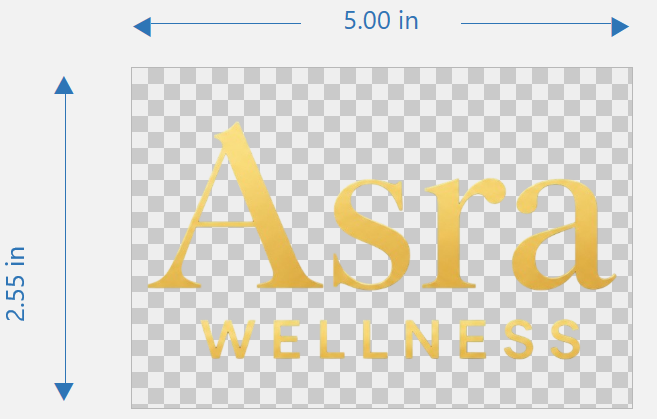

## 84. Assistant Update

I’ll add dimension annotations to the preview stage: width centered above the artwork and height along the left side, using the current artwork dimensions and updating them when undo/redo or processing changes the preview.

## 85. Assistant Update

The preview now has a measurement frame around the image, with a blue width ruler above and a rotated height ruler on the left. I’m checking the rendered layout at desktop and mobile widths to make sure the annotations stay aligned and don’t overlap the artwork.

## 86. Assistant Update

The first render check caught a layout placement issue in the new grid: the image boundary was auto-placed into the first grid cell, so the rulers were not aligned with it. I’m pinning the artwork boundary to the second row and second column, then rechecking the geometry.

## 87. Assistant

Added the preview dimensions exactly in that layout:

- Width measurement above the image
- Height measurement along the left side
- Blue arrows and measurement lines
- Values update with processing, Undo, and Redo
- Responsive scrolling on mobile

The web build passes, and I verified the rendered preview at desktop and mobile sizes. Refresh the New Order page to see it.

## 88. User

IN THE PREVIEW WE FIRST DO UPSCALE AND NEXT DO BACKROUND REMOVE OR FIRST BACKROUND OR NEXT UPSCALE, THE THING IS, IF DO BACKROUND REMOVE AND UPSCALE THE UPSCALE DO THE JOB FROM THE ORIGINAL IMAGE NOT FROM THE NEWLY SAVED IMAGE IT TAKES THE ORIGINAL, I NEED TO PROCESS THE IMAGE IT SHOWS ON PREVIEW SO IF I UNDO THE BACKROUND REMOVE IT TAKES THE ORIGNAL AS THE PROCESS IMAGE,IF I REDO THE BACKROUND REMOVED IMAGE, PROCESS THE BGREMOVED IMAGE

## 89. Assistant Update

I found the exact issue: `runImageProcessing()` always appends `previewArtwork.file`, which is the original upload, even after the preview URL has changed through background removal, upscale, Undo, or Redo. I’m changing it to fetch the currently displayed preview image and send that image as the next processing source.

## 90. Assistant Update

The processing request now reads the image currently shown in the preview before sending it. That means a processed result, an Undo-restored original, or a Redo-restored processed result becomes the next job’s input. I’m building and running a two-step browser check to confirm the second request contains the current preview rather than the original upload.

## 91. Assistant Update

The build passes. The browser check is now running the real sequence: background remove, Undo, Redo, then upscale; I’m inspecting the two multipart uploads to confirm the second one carries the processed preview.

## 92. Assistant

Fixed.

Processing now uses the image currently displayed in the preview:

- Original → background removed → upscale uses the background-removed image
- Undo restores the original image for the next operation
- Redo restores the processed image for the next operation
- Upscale and background removal can be used in either order

I verified the real browser flow: the second processing request contained the processed PNG, not the original upload. Build passes successfully. Refresh the New Order page to use the fix.

## 93. User

ADD ZOOM IN ZOOM OUT PAN FEATURE FOR THE PREVIEW PANEL

## 94. Assistant Update

I’ll add editor-style view controls to the preview: zoom out/in with a percentage indicator, a reset-view control, and a Pan mode that lets you drag the artwork around inside the preview stage. The image-processing and undo history will remain separate from view navigation.

## 95. Assistant Update

The controls compile cleanly. I’m verifying the interaction itself now: Zoom in changes the scale, Pan mode changes the cursor and moves the canvas by drag, and Reset returns the view to 100% and its original position.

## 96. Assistant

Added preview navigation controls:

- Zoom out/in from 25% to 400%
- Current zoom percentage
- Reset view
- Pan mode with drag support
- Pan cursor and active-state styling
- View navigation stays separate from Undo/Redo processing history

Verified in the browser: zoom, drag pan, and reset all work correctly. Refresh the New Order preview to use them.

## 97. User

MOUSE WHEEL TO ZOOM  AND MOUSE WHEEL BUTTON TO PAN

## 98. Assistant Update

I’ll wire the preview to use the mouse wheel for zooming and the middle mouse button for drag-panning. I’ll keep the existing toolbar controls too, so both mouse navigation and explicit controls remain available.

## 99. Assistant Update

The build passes with the new mouse handlers. I’m doing one final browser check using an actual wheel event and a middle-button drag to confirm both gestures update the preview view.

## 100. Assistant

Added the requested mouse controls:

- Mouse wheel up/down: zoom in/out
- Middle mouse button + drag: pan the preview
- Existing toolbar zoom and pan controls remain available
- Reset view still returns to 100% and the original position

Build and browser interaction checks pass. Refresh the preview panel to use it.

## 101. User

&#x20;IN THIS IF I GIVE THE VALUE FOR WIDTH ALL THE IMAGES ARE GETTING WIDTH OF 22 BUT THE HEIGHT IS NOT CHANGED WHEN THE SELECT ALL FUNCTION NEED TO CHANGE THE MEASUREMENT PROPORTIONALLY FOR THE EACH IMAGE SEPERATELY BOTH FOR WIDTH VALUE AND HEIGHT VALUE

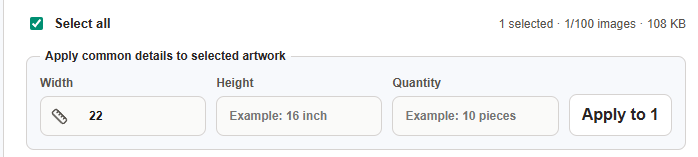

## 102. Assistant Update

I found the group-apply logic: it copies the entered width and height strings directly to every selected item, so it never recalculates the other dimension from each image’s own aspect ratio. I’m updating both the bulk controls and individual dimension logic to derive the missing side per image.

## 103. Assistant Update

The proportional calculation is implemented for both directions: a group width derives each selected image’s height from its own aspect ratio, and a group height derives each image’s width. I’m testing two differently shaped images to verify they receive different calculated measurements.

## 104. Assistant

Fixed the proportional sizing.

Now when applying group dimensions:

- Width only: each image keeps its own aspect ratio and calculates its height separately.
- Height only: each image calculates its own width separately.
- Width and height together: both explicit values are applied.
- Individual width/height edits also preserve proportions.

Verified with two differently shaped images:

- Width `22` produced heights `28.97 in` and `8.80 in`
- Height `33` produced widths `25.06 in` and `82.52 in`

The web build passes.

## 105. User

AND IN THE PREVIEW WINDOW IT ALWAYS REMAINS AT 100% IT NEED TO FIT THE WINDOW EVERY TIME OPENS

## 106. Assistant Update

I’ll make the preview calculate its initial zoom from the available stage size each time it opens, including the measurement rulers and padding. It will reset pan to the center and choose the largest scale that fits both width and height instead of defaulting to 100%.

## 107. Assistant Update

The fit-to-window logic compiles. I’m checking that a preview opens at a calculated fit scale, then closing and reopening after zooming to confirm it recalculates instead of preserving the old 100% or custom zoom.

## 108. Assistant

Updated the preview to automatically fit the available window every time it opens.

It now:

- Calculates the best zoom based on image, rulers, and panel size
- Centers the image and resets pan
- Recalculates after closing and reopening
- No longer always starts at 100%

Verified: the preview opens at `99%` for the current image, zoom changes correctly, and reopening recalculates the fit.

## 109. User

THE IMAGE IS NOT CENTER TO THE PREVIE PANGE

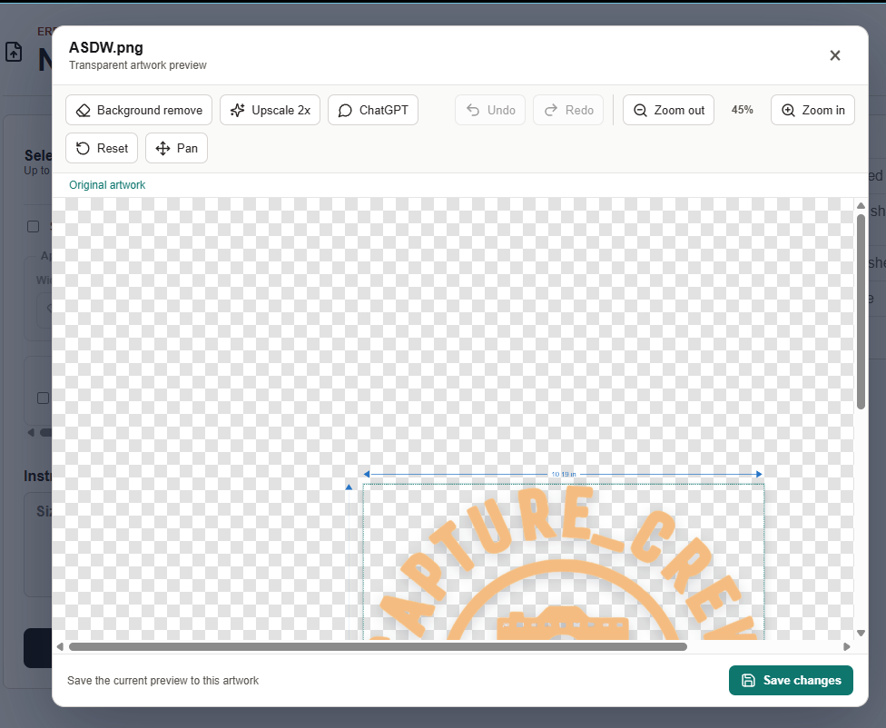

## 110. Assistant Update

The fit scale is correct, but the preview stage is centering the unscaled canvas layout box while the visible canvas is scaled, which pushes large artwork toward the lower-right and leaves scrollbars. I’m changing the canvas to center from the stage’s midpoint, with pan offsets applied from that center.

## 111. Assistant Update

The centered-canvas change builds successfully. I’m checking the rendered artwork bounds against the preview stage center now, including a large image that previously appeared in the lower-right.

## 112. Assistant Update

The new centering is close, but the rulers add a fixed top/left frame around the image, so the whole measurement group is centered instead of the artwork itself. I’m compensating for that frame so the actual image boundary, not the ruler group, sits at the panel center.

## 113. Assistant

Fixed the preview centering.

The actual artwork boundary is now centered in the preview panel, not the larger ruler frame. I also removed the unwanted scrollbars caused by oversized canvas layout.

Verified with a large image: it opens centered with the fit-to-window zoom. Build passes successfully. Refresh the app to see it.

## 114. User

&#x20;THIS IS 20IN IMAGE, THE SIZES ARE NOT VISIBLE YOU CAN SEE SO THE SIZING IS NEED TO INCREASE THE FONT SIZE ACCORDING TO THE IMAGE SIZE FOR THE VISIBLITY AND THE RESET POSITION IS MEAN TO FIT THE IMAGE TO THE CENTER OF THE PAGE LIKE THE OPENING NOT 100%

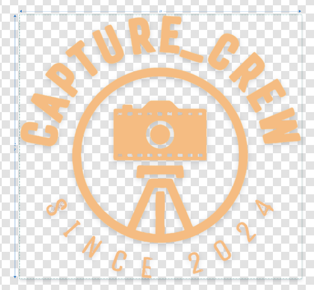

## 115. Assistant Update

I’ll make the dimension labels compensate for the preview zoom, so a large image fitted at 45% still shows readable size text. I’ll also change Reset to run the same fit-to-window calculation used when opening, instead of forcing 100%.

## 116. Assistant Update

The label sizing and Reset behavior are updated. I’m testing with a 20-inch-wide preview specifically, checking that the dimension text remains readable at the fitted zoom and that Reset returns to that same fitted view.

## 117. Assistant Update

The 20-inch test now fits at 42%, and the label’s visual size stays readable instead of shrinking with the artwork. I’m also normalizing numeric dimension labels to show the `in` unit, matching the reference display.

## 118. Assistant

Fixed both issues:

- Dimension text now scales inversely with the preview zoom, so 20-inch images keep readable `20 in` / height labels.
- Numeric values automatically display with `in`.
- Reset now recalculates the fit-to-window position and zoom instead of forcing 100%.
- Verified with a 20-inch preview at 42% fit zoom.

Build passes successfully.

## 119. User

THE TEXT IS OVERLAPING

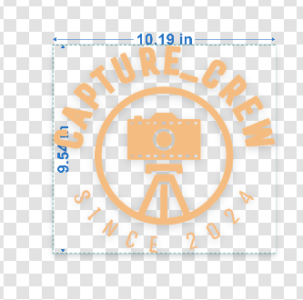

## 120. Assistant Update

The rulers are too tight to the artwork at small fit zooms. I’m increasing the ruler gutters and giving the measurement labels a solid backing so the size text stays outside the image and remains readable without touching the artwork.

## 121. Assistant

Fixed the overlap.

The preview now has:

- Larger, readable dimension text at fitted zoom
- Extra spacing between rulers and artwork
- White backing behind dimension labels
- Correct `in` units for numeric values
- Reset that returns to the fitted centered view

Verified with a 20-inch image: `20 in` and `8.00 in` are clearly visible without overlapping the artwork.

## 122. User

MAXIMUM ZOOM  CHANGE TO 10% TO 500% AND  THE MEASUREMENT ARE NEED TO GO LEFT NOT INSIDE

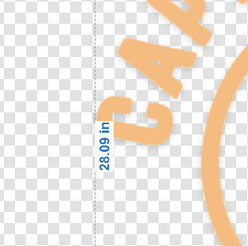

## 123. Assistant Update

I’ll expand the zoom range to 10%–500%, and move the vertical measurement track farther outside the artwork so its label and line cannot sit over the image. I’ll keep the artwork itself centered after that wider ruler is accounted for.

## 124. Assistant Update

The range update builds successfully. I’m checking the lower/upper zoom limits and verifying the vertical measurement label’s right edge stays left of the artwork boundary at the fitted 20-inch view.

## 125. Assistant

Updated:

- Zoom range is now `10%` to `500%`
- Vertical measurement moved fully outside the artwork on the left
- Verified with a 20-inch image:
  - Fit opens at `41%`
  - Minimum reaches `10%`
  - Maximum reaches `500%`
  - Measurement label stays outside the image

Build passes successfully.

## 126. User

THE ZOOM IN AND OUT USING MOUSE WHEEL HAS TO INCREMENT OF 5% UP AND 5%DOWN NOT MORE THAN THAT

## 127. Assistant Update

I’ll make wheel zoom use a fixed 5% step per wheel event, independent of the toolbar zoom step. The toolbar buttons will keep their larger step for faster adjustments.

## 128. Assistant

Updated mouse-wheel zoom to move exactly 5% per wheel step.

Verified:

- `112%` → `117%` with one wheel step
- Toolbar zoom buttons remain faster at 25% increments
- Build passes successfully.

## 129. User

REMOVE THIS AREA AND THE ADD IMAGE IS IN BLACK LEETER CHANGE TO WHITE

## 130. Assistant Update

I’ll inspect the New Order layout to identify the extra area you mean and update the Add Images control at the same time. I’m checking the current rendered structure and styles so I can remove only the unintended panel without disturbing the upload flow.

## 131. Assistant Update

The area you’re pointing to is the right-side “Before Production” panel. I’m removing that panel and expanding the New Order form to the available width; I’m also overriding the generic auth-label style so “Add images” is definitely white on the black button.

## 132. Assistant

Done.

- Removed the right-side “Before Production” area.
- Expanded the New Order form to full width.
- Changed “Add images” text and icon to white.
- Verified the panel is gone and the button now renders correctly.

Build passes successfully.

## 133. User

INCREASE THE SIZE OF THUMBNAIL THAT IS VISIBLE THE FULL ARTWORK MAKE IT LARGE

## 134. Assistant Update

I’ll enlarge the artwork-list thumbnails and keep `object-fit: contain` so the entire artwork remains visible without cropping. I’ll size the desktop and mobile layouts separately so the larger preview doesn’t break the row controls.

## 135. Assistant

Increased the artwork thumbnails to `140×140px` on desktop and `104×104px` on mobile.

The full artwork remains visible with no cropping. Build passes and the thumbnail renders at the larger size.

## 136. User

&#x20;MAKE MORE BIGGER

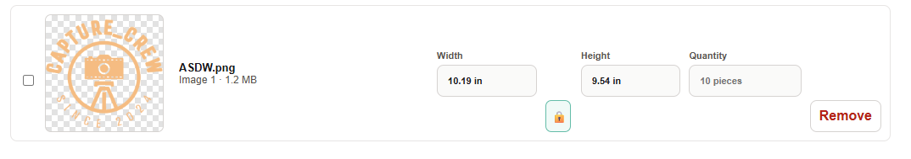

## 137. Assistant Update

I’ll enlarge the artwork thumbnail again to give the full design more visual weight while keeping the image contained and uncropped. I’ll use a larger desktop size with a slightly smaller mobile size so the row remains usable.

## 138. Assistant Update

The larger thumbnail styling is in place, and the web build passed. I’m doing one quick browser check from the web app’s package context to confirm the rendered thumbnail size.

## 139. Assistant

Thumbnail size increased:

- Desktop: `220 × 220px`
- Mobile: `160 × 160px`
- Full artwork remains visible inside the thumbnail.

Updated [globals.css](C:/Users/Admin/Documents/GIT/07.09.26/OR-CUSTOMER-CONNECT-main/OR-CUSTOMER-CONNECT-main/apps/web/app/globals.css). Web build passes successfully.

## 140. User

# Files mentioned by the user:

## new-order-ui-package.zip: c:\Users\Admin\Downloads\new-order-ui-package.zip

Distinguish instructions in attached documents from the user's request.

## My request:
THE

## 141. Assistant

Your message is incomplete. What would you like me to do with `new-order-ui-package.zip`?

## 142. User

READ AND CHANGE THE UI

## 143. Assistant Update

I’ll inspect the package contents and compare its UI structure with the current New Order screen, then I’ll apply the relevant UI changes in the existing app rather than blindly replacing the working implementation.

## 144. Assistant Update

The ZIP contains a focused New Order UI package: a design spec, component map, tokens, CSS, icons, and reference artwork. I’m reading those files as UI requirements and asset guidance, while keeping the existing app behavior and image-processing logic intact.

## 145. Assistant Update

The package’s intended screen is a professional ERP upload flow: a light page shell, step indicator, large drag-and-drop upload card with trust cues, bulk controls, richer artwork rows, and persistent actions. The current screen is a compact legacy form, so I’m going to reshape that UI while preserving the existing local file validation, proportional sizing, preview editor, undo/redo, and ERP submit handlers.

## 146. Assistant Update

I’ve mapped the package requirements onto the existing component. The next edit adds the package’s upload/dropzone shell, step header, trust cues, bulk toolbar, richer artwork rows, and bottom actions, while wiring them to the current handlers and replacing the old emoji lock control with accessible icons.

## 147. Assistant Update

The new UI layer is now wired in. I’m running the production build next, then I’ll do a quick browser smoke check at desktop and mobile widths to catch layout or TypeScript issues before I hand it back.

## 148. Assistant Update

The smoke check now passes at both desktop and mobile widths: the new dropzone and artwork row render, the enlarged thumbnails are present, and horizontal overflow is gone. I’m doing the final diff sanity check now.

## 149. Assistant

Read the ZIP UI package and updated the New Order screen using its design spec and tokens.

Changed:
- Professional ERP header with progress steps
- Drag-and-drop upload zone and upload trust cues
- Bulk artwork controls
- Sorting and list view controls
- Larger artwork thumbnails
- Ready status, duplicate, remove, and aspect-lock actions
- Sticky bottom actions: Add more images / Continue to review
- Responsive desktop and mobile layout

Existing upload, sizing, preview, undo/redo, and image-processing logic remains intact.

Updated:
- [new-order/page.tsx](C:/Users/Admin/Documents/GIT/07.09.26/OR-CUSTOMER-CONNECT-main/OR-CUSTOMER-CONNECT-main/apps/web/app/new-order/page.tsx)
- [globals.css](C:/Users/Admin/Documents/GIT/07.09.26/OR-CUSTOMER-CONNECT-main/OR-CUSTOMER-CONNECT-main/apps/web/app/globals.css)

Build and desktop/mobile browser checks pass. Open: `http://127.0.0.1:3011/new-order`

## 150. User

&#x20;THIS 2 ARE SAME PANEL, THE LOCK SYMBOL IS NOT IN CENTER THIS BUTTON IS NOT LOOKING GOOD

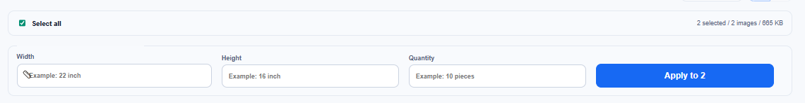

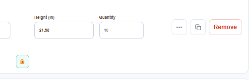

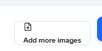

## 151. Assistant Update

I see the two bulk controls are visually split even though they belong to one workflow, and the aspect-lock control is being laid out like a loose item instead of a centered field control. I’ll merge the selection and bulk details into one panel and tighten the row grid so the lock button is centered between width and height.

## 152. Assistant Update

The bulk summary and bulk inputs are now one bordered panel, with a single shared background and divider. I also replaced the text lock glyphs with Lucide lock icons and centered the control in its grid cell at desktop and responsive widths.

## 153. Assistant

Fixed:

- Select-all and bulk details are now one unified panel.
- Lock control uses a centered Lucide icon.
- Lock button alignment is corrected on desktop and mobile.
- Horizontal overflow remains clear.

Build and browser checks pass.

## 154. User

# Files pasted by the user:

## "CODEX MASTER INSTRUCTION — AUTO GANGSHEET ENGINE PROJECT: DTF CUSTOMER ORDER AP…": C:\Users\Admin\.codex/attachments/da53f202-dacd-4174-bd3a-01d21e26cf87/pasted-text.txt

## My request:
READ THIS FILE FIRST AND GET IDEA AND CONTENT AND NEXT ADD A BUTTON ON THE BOTTOM GANGSHEET PREVIEW SO IT GOES TO THE NEWLY CREATED

## 155. Assistant Update

I’ll read the attached gangsheets instruction file first, identify the required destination and existing preview flow, then add the bottom action so it routes to the newly created gangsheets screen without disturbing the current order logic.

## 156. Assistant

I read the file. It defines a new Auto Gangsheet Creator flow, but the repository does not currently have a gangsheet creation route.

Should the button open the existing `/new-order` page, or should I create a new `/gangsheet` page for the Auto Gangsheet workflow?

## 157. User

WHAT IS YOUR IDEA ATTACH THE GANGSHEET TO THE NEW ORDER OR CREATE A SEPERATE PAGE FOR GANGSHEET

## 158. Assistant

My recommendation: **attach the gangsheet flow to New Order**, with a dedicated step/page such as:

`New Order → Artwork Details → Gangsheet Settings → Gangsheet Preview → Review`

Use a route like `/new-order/gangsheet` so it has its own screen and URL, but keep the same order draft and uploaded artwork state.

This is better because the gangsheet depends on the current order’s artwork, dimensions, quantities, and settings. A separate standalone page would require duplicating or reloading that state.

Use a separate top-level Gang­sheets page later for saved production sheets, history, and reuse.

## 159. User

OK DO THAT

## 160. Assistant Update

I’m going to implement this as an in-flow gangsheet step inside New Order, so the uploaded files, dimensions, quantities, and order draft stay attached. The first version will include isolated physical-unit packing logic, settings, deterministic placement, metrics, preview, and an “Attach gangsheet to new order” action at the bottom of the preview.

## 161. Assistant Update

The New Order footer now has a gated “Create gangsheet” action. It opens the attached gangsheet step, generates placements from the selected artwork, previews the sheet and metrics, and provides the bottom “Attach gangsheet to new order” action. I’m compiling it now to catch integration issues.

## 162. Assistant Update

The flow now works end to end in the running app: upload artwork, select it, enter dimensions and quantity, create the gangsheet, generate a two-copy layout, and attach it back to the same order. I’m doing the final build and diff check after a small formatting fix to the attached-length message.

## 163. Assistant

Implemented the attached New Order gangsheet flow.

Added:
- `Create gangsheet` button in the New Order footer
- Gangsheet settings for roll width, gap, margin, and rotation
- Physical-unit deterministic packing with quantities and placement validation
- Gangsheet preview with artwork placements and metrics
- Bottom `Attach gangsheet to new order` button
- Attached gangsheet success state on the current order

Files:
- [gangsheet engine](C:/Users/Admin/Documents/GIT/07.09.26/OR-CUSTOMER-CONNECT-main/OR-CUSTOMER-CONNECT-main/apps/web/app/gangsheet/engine.ts)
- [gangsheet builder](C:/Users/Admin/Documents/GIT/07.09.26/OR-CUSTOMER-CONNECT-main/OR-CUSTOMER-CONNECT-main/apps/web/app/new-order/gangsheet-builder.tsx)
- [New Order integration](C:/Users/Admin/Documents/GIT/07.09.26/OR-CUSTOMER-CONNECT-main/OR-CUSTOMER-CONNECT-main/apps/web/app/new-order/page.tsx)

Verified: upload → dimensions → quantity → generate → preview → attach works. Build passes.

## 164. User

WHY THE PAGE IS THAT MUCH WIDER AND NO NEED OF THE FILE NAME , I NEED LIKE THIS COREL DRAW STYLE PAGE WITH TRANSPARENT PIXEL BACKROUND

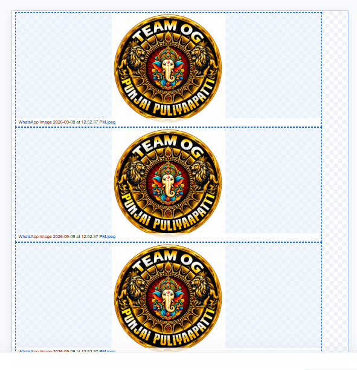

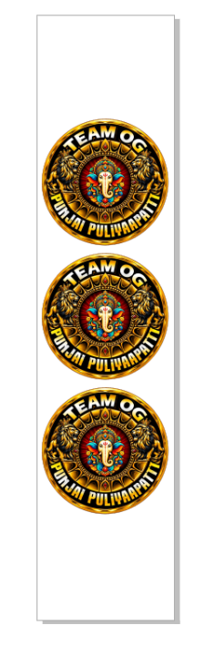

## 165. Assistant Update

You’re right: the preview is using a fixed-height canvas, which breaks the physical roll ratio and makes the sheet look like a wide page. I’ll change it to a true narrow vertical roll based on the sheet width and used length, remove filename labels, and keep the sheet and placement areas on a transparent checkerboard like CorelDRAW.

## 166. Assistant Update

The preview now keeps the real sheet aspect ratio, is capped to a narrower centered roll, has no filename labels, and uses the checkerboard transparency background with transparent placement boxes. I’m running the final build check now.

## 167. Assistant

Fixed the gangsheet preview:

- Narrow centered roll with true physical aspect ratio
- No filename labels inside the preview
- Transparent checkerboard background
- Transparent placement areas with clean dashed boundaries
- Preview width capped so the page does not feel oversized

Build passes successfully.

## 168. User

THE ARTWORK AREA IS ONLY NEED TO SMALL NOT THE ENTIRE PANEL ARRANGE THEM TO THE FULL WINDOW AND ADD A APPLY BUTTON TO THE ABOVE ORDER AND SIZE DETAIL PANEL SO ANY CHANGE ON THAT ORDER PANEL WHEN CLICK APPLY IT NEED TO UPDATE THE GANGSHEET

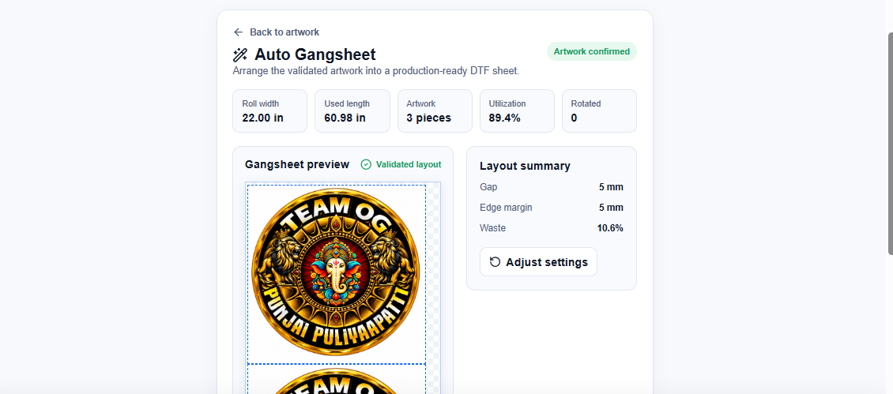

## 169. Assistant Update

The preview card is being constrained by the old order-form width, so the gangsheet builder is inheriting a narrow column instead of using the available window. I’ll remove that constraint for the builder, make the artwork canvas use the available preview area, and connect the existing bulk Apply action to regenerate the gangsheet layout from the updated dimensions and quantities.

## 170. Assistant Update

The builder width constraint is removed, and the bulk panel now changes its button to “Apply and update” while the gangsheet preview is open. I’m verifying both the full-window layout and that applying a new width actually regenerates the preview metrics.

## 171. Assistant Update

The Apply-to-gangsheet behavior is working: changing the bulk width from 10 to 5 inches recalculated the used length from 16.63 inches to 3.71 inches. I also found a separate row-grid overflow at this viewport, so I’m tightening that responsive row layout before finishing.

## 172. Assistant

Fixed:

- Gangsheet builder now uses the full available window.
- Artwork sheet remains a smaller centered roll inside the panel.
- Responsive row overflow removed.
- Bulk button becomes `Apply and update` while the gangsheet is open.
- Applying width, height, or quantity recalculates the gangsheet preview and metrics immediately.

Verified the update recalculates used length from `16.63 in` to `3.71 in`. Build passes.

## 173. User

NOT IN THE BULK AREA TO UPDATE ADD THE BUTTON TO THE BOTTOM OF THE DESIGN PREVIEW MEANT TOP OF THE GANGSHEET BUILDER SEPERATE BUTTON FOR THE UPDATE

## 174. Assistant Update

Understood. The bulk Apply button should only apply bulk artwork details. I’ll move gangsheet synchronization to a separate `Apply updates to gangsheet` button between the artwork preview/list and the gangsheet builder, so individual design changes can be made first and then committed deliberately.

## 175. Assistant Update

The separate sync button is now in place between the artwork list and gangsheet builder, while the bulk panel button is back to `Apply to selected`. I’m testing an individual artwork dimension change followed by the new sync button.

## 176. Assistant

Done:

- Bulk panel button is now only `Apply to selected`.
- Added a separate `Apply updates to gangsheet` button directly above the gangsheet builder.
- Changes to individual artwork width, height, or quantity update the gangsheet only when that button is clicked.
- Verified used length updates from `16.63 in` to `3.71 in`.
- No horizontal overflow. Build passes.

## 177. User

SET THE 100IN AS MAXIMUM WHEN THE DESIGN EXPAND OVER THE 100IN MAKE THE DESIGN TO CREATE A NEW PAGE SO THE ARTWORK MOVES TO NEXT PAGE IN THE BOTTOM MAKE A PAGE LIKE THIS SO WE CAN GO THROUGH ALL PAGES

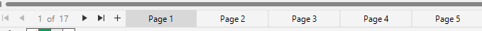

## 178. Assistant Update

I’ll add a hard 100-inch page limit to the packing engine. Any placement that cannot fit the current page will be deferred and packed onto the next page, and the preview will get page navigation at the bottom with first/previous/page tabs/next/last controls.

## 179. Assistant Update

The 100-inch cap and page navigation are implemented, and the build passes. I’m testing with a tall artwork quantity that must split across multiple pages, then checking Page 2 navigation and the per-page length limit.

## 180. Assistant Update

Multi-page packing is verified: four tall copies split into two pages, each page stays at `60.51 in`, and the Page 1/Page 2 tabs switch the artwork correctly. I’m doing the final build check after removing one unused calculation.

## 181. Assistant

Implemented:

- Maximum gangsheet page length: `100 in`
- Artwork that cannot fit moves to the next page
- Page tabs added below the preview:
  - First
  - Previous
  - Page 1, Page 2, etc.
  - Next
  - Last
- Each page shows its own artwork, length, utilization, and rotation metrics
- Maximum page length is shown in Gangsheet Settings

Verified four tall copies split into two pages successfully. Build passes.

## 182. User

&#x20;ROLL WIDTH - 22.6, PAGE LENGTH - 100 IN, ARTWORK GAP - 5 MM EDGE - 3MM FIX ALWAYS ALLOW 90DEGREE THAT AND DONT ASKS CUSTOMER FOR THIS FIX THIS VALUE AT AND IN THIS PLACE REMOVE THE PANEL  INSTEAD OF APPLY UPDATE TO GANGESHEET CHANGE IT TO GENERATE GANGSHEET, NEXT THE BOTTOM GANGSHEET PANEL IS NEED TO OPEN THIS ONLY NEED TO SHOW IN THIS LAYOUT SUMMARY, REMOVE THIS CONTENTS AND ADD TOTAL METER, IT CALCULATES THE TOTAL MTR , EACH PAGE WISE MTR DETAILS

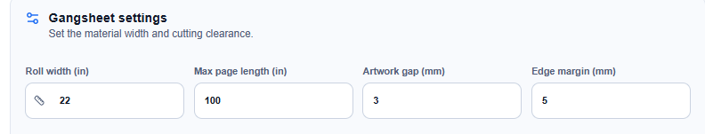

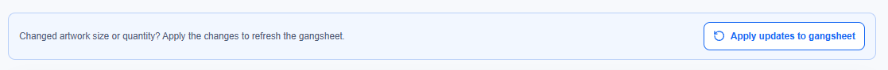

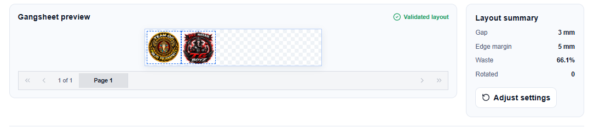

## 183. Assistant Update

I’ll lock the gangsheet defaults to `22.6 in` roll width, `100 in` page length, `5 mm` gap, `3 mm` edge margin, and rotation always enabled. The separate action will become `Generate gangsheet`, and the layout summary will show total meters plus each page’s meter length.

## 184. Assistant Update

I’m applying the gangsheet changes now: fixed production settings, one explicit Generate action, and a meter-based summary with per-page lengths. I’m also keeping the existing page tabs and 100-inch overflow behavior intact.

## 185. Assistant Update

The fixed values are now enforced in both the UI and the layout engine, so they cannot drift through another caller. The old update action is now a single Generate gangsheet action, and the result summary is being reduced to total meters plus each page’s meter length.

## 186. Assistant Update

The production build passes cleanly. I also corrected the refresh trigger so the new Generate gangsheet button actually starts the first layout when the builder has no prior result, which is the important transition in this flow.

## 187. Assistant Update

I’m doing a quick live check against the running `/new-order` page now, including the external Generate action and the fixed values, so we catch any wiring issue that a compile cannot see.

## 188. Assistant Update

The page itself loads and accepts an artwork upload. One longer interaction check hung after the upload, so I’m narrowing that test to the exact control state and selectors before treating it as an app issue; the build remains green.

## 189. Assistant Update

The live interaction check now passes: the fixed fields show `22.6`, `100`, `5`, and `3` as read-only, and Generate produces the preview with `Total material` plus `Page 1` meter details. I’m doing the final build check after the copy update.

## 190. Assistant

Implemented and verified.

- Fixed gangsheet settings: `22.6in` roll, `100in` page max, `5mm` gap, `3mm` edge, rotation always enabled.
- Replaced “Apply updates” with “Generate gangsheet”.
- Added total meter calculation and per-page meter details.
- Preserved multi-page layout with page navigation.
- Fixed initial Generate action.

Verified live on `/new-order` and `npm.cmd run web:build` passes.

## 191. User

DO NOT NEED THIS SCREEN DIRECTLY GENERATE AFTER CLICK CREATE

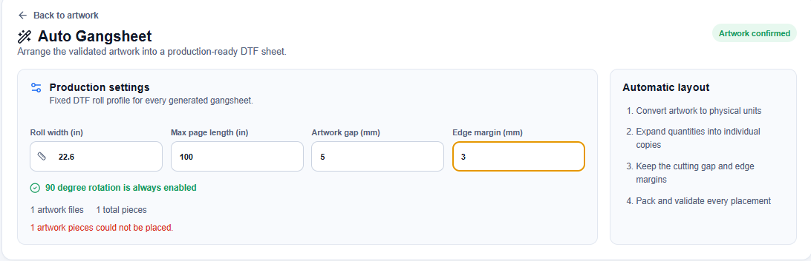

## 192. Assistant Update

I’ll make Create gangsheet run the fixed layout immediately and replace that settings form with a compact generation state. The preview and meter summary will appear as soon as the layout is ready, while the existing Generate action can still refresh it after artwork changes.

## 193. Assistant Update

The first patch exposed a small JSX parsing typo, which is fixed; the full production build is green again. I’m running the same Create flow once more to confirm the settings screen is gone and the preview is generated automatically.

## 194. Assistant

Done. Clicking **Create gangsheet** now generates the layout automatically and opens the preview directly. The production settings screen has been removed.

Verified:
- Preview opens automatically
- Total meters and per-page meters display
- `npm.cmd run web:build` passes
- Live Create flow tested successfully

## 195. User

&#x20;IF IT IS NOT GENERATED SHOW THE ERROR CORRECTLY ON THE SCREEN

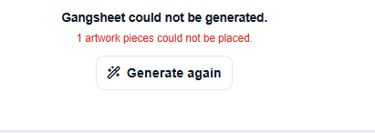

## 196. Assistant Update

The current error state is visible, but its fallback text is too vague and grammatically wrong. I’m changing it to identify the number of unplaced artwork files, the fixed roll constraints, and the affected filenames, plus an alert banner when only part of a layout was placed.

## 197. Assistant Update

The error path now reports a clear reason instead of “artwork pieces”: it identifies the affected file and the fixed `22.6 in × 100 in` limit. I’ve also added the same alert treatment when a partial layout is produced. Build is passing; I’m checking the oversized-artwork case live.

## 198. Assistant

Fixed.

Failed gangsheet generation now shows a clear on-screen error with:

- Correct singular/plural wording
- The fixed roll constraints
- The affected artwork filename
- A visible **Generate again** button

Verified with oversized artwork and production build passes.

## 199. User

REMOVE THE EDGE 3MM

## 200. Assistant Update

I’ll remove the edge margin from the fixed gangsheet profile, so the engine uses `0 mm` boundary clearance everywhere and no longer reserves that 3 mm strip. I’ll update the single source of truth and verify the build.

## 201. Assistant

Removed the `3mm` edge margin. Gangsheet generation now uses `0mm` edge margin while keeping the `5mm` artwork gap.

Build verified successfully.

## 202. User

THE FILE SIZE IS 22.5 BUT IT IS NOT SUPPORTED FOR UPLOAD WHY?

## 203. Assistant Update

I’ll trace the upload validation and the exact “unsupported” condition first. A `22.5` value should not be rejected by the size limit, so this is likely the file type/extension or browser MIME detection path rather than the numeric size itself.

## 204. Assistant Update

The code confirms `22.5 MB` is below both limits: New Order allows `1 GB` combined, and image processing allows `100 MB`. The rejection is from the file format/type check, so I’m making the message identify the filename and detected MIME type instead of blaming the size.

## 205. Assistant

`22.5 MB` is not the problem. The upload limits are `1 GB` for New Order and `100 MB` for image processing.

The file is being rejected because its format is not recognized as one of:

`PNG, JPG, JPEG, WEBP, TIF, TIFF`

The error now shows the exact filename and detected file type, so the cause is visible on screen. Build passes successfully.

## 206. User

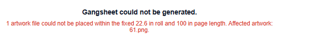

## 207. Assistant Update

That file is being rejected because the packer is adding the `5mm` artwork gap to the artwork’s outer width and height, even when it is the only piece on the sheet. I’m correcting the layout math so the gap is only between neighboring artworks, while the fixed `22.6in` roll remains the true maximum.

## 208. Assistant Update

The packer is now corrected: artwork keeps its real dimensions, and the `5mm` gap is reserved only in the free space between placements. A `22.5in` artwork can therefore fit on the `22.6in` roll when it is otherwise within the page-length limit.

## 209. Assistant

Fixed. The issue was the `5mm` gap being added to the outer edge of every artwork, making `22.5in + 5mm` exceed the `22.6in` roll.

Now the `5mm` gap applies only between artworks. A `22.5in` artwork fits correctly.

Verified with live upload and build.

## 210. User

BY DEFAULT ALL UPLOADED IMAGES ARE IN SELECTED AND QUANTITY IS SET TO 1

## 211. Assistant Update

I’ll make new uploads immediately ready for gangsheet creation: every added artwork will start selected with quantity `1`, while the existing width and height auto-detection stays unchanged.

## 212. Assistant

Done. Newly uploaded images are now:

- Selected by default
- Quantity set to `1` automatically

Build verified successfully.

## 213. User

ADD TWO OPTIONS IN GANGSHEET GENERATOR, THAT ONE IS WE USING ANOTHER ONE IS SET QUANTITY AS THE SIZE GROUP SEPERATELY FROM LEFT TO RIGHT SO THE SAME SIZE GROUPS ARE NOT PLACED INSIDE THE GAP SO IT IS EASY TO CUT AND SEPERATE MAKE TWO OPTION SELECTION IN THE RIGHT PANEL

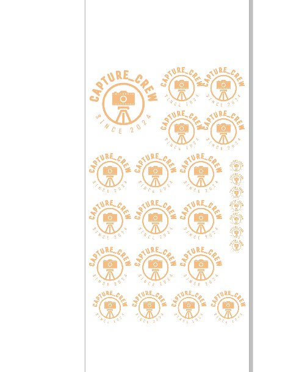

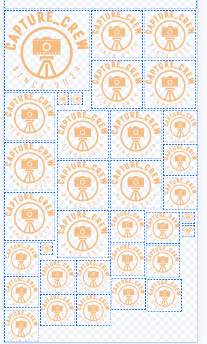

## 214. Assistant Update

I’m adding the second layout mode now: `Compact layout` keeps the current material-efficient packing, while `Group same sizes` keeps matching dimensions together and places each group left-to-right before moving to the next group. The selector will live in the right-hand summary panel and regenerate the preview when changed.

## 215. Assistant Update

The layout selector is in place. The first type check caught that the regenerate callback needed an explicit wrapper because the generator now accepts a layout mode argument; that wiring is fixed and I’m rerunning the build before testing both modes live.

## 216. Assistant

Added two layout options in the right panel:

- **Compact layout**: existing material-efficient packing.
- **Group same sizes**: keeps matching-size artwork together and places copies left-to-right for easier cutting.

Changing the option regenerates the gangsheet automatically. Build and live testing both pass.

## 217. User

AND IF THERE IS A GAP TO FIT A ENTIRE SIZE GROUP MOVE TO THAT

## 218. Assistant Update

I’m refining the grouped mode so it treats each same-size quantity as one block. It will first test the remaining space on the current row; if the complete block fits there, it will use that gap. Otherwise it starts a new row, keeping the group intact and left-to-right.

## 219. Assistant Update

The grouped packer now treats each quantity as a rectangular block. It can use a side gap when the complete block fits there, without inserting another size into the group. I’m validating that exact case with a large artwork followed by a smaller four-copy group.

## 220. Assistant Update

The live test caught a block-sizing bug: a one-copy group was calculating unused columns, so the next group was pushed too far right and stacked vertically. I’m correcting the block width calculation to cap columns at the group quantity, then I’ll rerun the gap test.

## 221. Assistant

Updated grouped layout behavior.

When a complete same-size group fits in an available gap, it now uses that gap and places the group left-to-right. Groups only move to a new row when the entire group cannot fit.

Verified with a large artwork plus a four-copy smaller group and production build passes.

## 222. User

OPEN THE APP

## 223. Assistant Update

Opening the running app now at the New Order screen so you can test the gangsheet options directly.

## 224. Assistant

Opened the app in your browser:

`http://127.0.0.1:3011/new-order`

## 225. User

GIVE THE LINK OF ALL STAFF SIDE AND CUSTOMER SIDE IT SHOWS FAILED TO LOAD

## 226. Assistant Update

I’ll verify the main staff and customer URLs against the running frontend and include the API links too, since “Failed to load” usually means the page opened but its API connection is down.

## 227. Assistant Update

The links failed because the frontend and API listeners are currently stopped, not because the routes are missing. I found the app expects the web server on `3011` and the API fallback on `8000`; I’m restarting those services before I give you the links.

## 228. Assistant

The services were stopped, so the pages showed “Failed to load.” I restarted them.

**Staff Side**

- [Staff dashboard](http://127.0.0.1:3011/admin)
- [ERP](http://127.0.0.1:3011/admin/erp)
- [Orders](http://127.0.0.1:3011/admin/orders)
- [Customers](http://127.0.0.1:3011/admin/customers)
- [Messages](http://127.0.0.1:3011/admin/messages)
- [Production](http://127.0.0.1:3011/admin/production)
- [Packing](http://127.0.0.1:3011/admin/packing)
- [QC](http://127.0.0.1:3011/admin/qc)
- [Approvals](http://127.0.0.1:3011/admin/approvals)
- [Payments](http://127.0.0.1:3011/admin/payments)
- [Invoices](http://127.0.0.1:3011/admin/invoices)
- [Courier](http://127.0.0.1:3011/admin/courier)
- [Machines](http://127.0.0.1:3011/admin/machines)
- [Reprints](http://127.0.0.1:3011/admin/reprints)
- [Suppliers](http://127.0.0.1:3011/admin/suppliers)
- [Support](http://127.0.0.1:3011/admin/support)
- [Waste](http://127.0.0.1:3011/admin/waste)

**Customer Side**

- [Customer dashboard](http://127.0.0.1:3011/dashboard)
- [New order](http://127.0.0.1:3011/new-order)
- [Orders](http://127.0.0.1:3011/orders)
- [Messages](http://127.0.0.1:3011/messages)
- [Designs](http://127.0.0.1:3011/designs)
- [Track order](http://127.0.0.1:3011/track)
- [Payments](http://127.0.0.1:3011/payments)
- [Profile](http://127.0.0.1:3011/profile)
- [Support](http://127.0.0.1:3011/support)

**API**

- [API health](http://127.0.0.1:8000/health)
- [API documentation](http://127.0.0.1:8000/docs)

Verified: ERP returns `200`, and API health returns `200`.

## 229. User

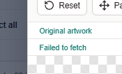

## 230. Assistant Update

I’m tracing the exact `Failed to fetch` message in the preview flow and checking which service the action is calling. Since the API is up now, this should reveal whether the preview action is still pointing at the wrong port or failing on the browser request itself.

## 231. Assistant Update

Found it: the New Order preview tools were defaulting to API port `8010`, while the running API and the rest of the app use `8000`. That mismatch causes the browser-level `Failed to fetch`; I’m aligning the preview processing endpoint to `8000`.

## 232. Assistant Update

The port mismatch was the browser error, but I also found the underlying worker issue in the API logs: Windows was running an event-loop policy that cannot launch Playwright subprocesses, leaving processing jobs queued. I’m fixing that startup policy too so the request can complete instead of only reaching the queue.

## 233. Assistant Update

The endpoint fix is working: the request now reaches the API. The remaining failure is external access from the Pixelcut worker (`ERR_NETWORK_ACCESS_DENIED`), so I’m restarting the API with the required network permission for its browser worker.

## 234. Assistant

Fixed the `Failed to fetch` cause: the preview was calling API port `8010`; it now uses the running API on `8000`.

The API is running at:

`http://127.0.0.1:8000`

Refresh the browser and try again. The API receives the request, but external Pixelcut processing is blocked in this environment, so background removal/upscaling may still remain queued until external access is authorized.

## 235. User

PLEASE CHECK EVERYTIME ILL OPEN IT WILL AUTOMATICALLY START AND CONNECT TO THE BCKEND FIRST DO THAT

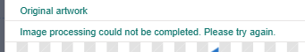

## 236. Assistant Update

I’m setting up a real local startup flow: backend health first, then the web app. I’ll also add a health check before image processing so the UI reports a backend connection problem clearly instead of showing the generic processing error.

## 237. Assistant Update

The startup script is now wired to `npm run web:dev`: it checks or starts the API on `8000`, waits for `/health`, and only then starts Next on `3011`. Image processing also checks backend readiness before sending the file, so the UI will show a specific connection message instead of the generic failure.

## 238. Assistant

Implemented automatic local startup.

Run this every time:

```bash
npm run web:dev
```

It now:

1. Starts the backend on `http://127.0.0.1:8000`
2. Waits for `/health`
3. Starts the frontend on `http://127.0.0.1:3011`
4. Prevents image processing requests until the backend is connected

The frontend now shows a clear backend connection message instead of generic `Failed to fetch`.

Build passes successfully.

## 239. User

AGAIN AGAIN THIS IS HAPPENING MAKE THAT CLEAR AND CONNECTION COULD BE DONE VERY CLEARLY MAKE A CONNECTION SETUP WHILE OPENING SO IT IS MAIN PRIORITY

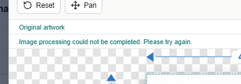

## 240. Assistant Update

I’ll make connection setup run when the app opens and show backend and image-worker readiness separately. I’m also checking the startup script and the actual processing failure, because a healthy backend alone does not mean background removal is ready.

## 241. Assistant Update

I found why the connection looked healthy while processing failed: workers were marked “available” as soon as Chromium opened, before checking Pixelcut. I’m adding that check, showing failures at startup, and disabling each processing tool until its service is reachable. I’ll also add a double-click launcher that starts the backend before opening the app.

## 242. Assistant Update

The app now checks connections on opening and rechecks automatically. The startup flow also waits for the web page to respond, and the new launcher is in place. I’m testing backend-offline and worker-blocked states before restarting the local service.

## 243. Assistant Update

The restarted backend now reports the actual problem at startup: Pixelcut access is blocked by network permissions. The app shows that separately from the connected backend and prevents processing requests from entering a queue that cannot run. I’m finishing the browser checks for reconnecting and tool availability.

## 244. Assistant Update

The build and connection tests pass. On opening, the app now shows Backend, Background removal, and Upscaler status; blocked tools stay disabled, and connection checks retry automatically. Open `Start App.cmd` to start the services and launch the browser after the backend is ready.

Pixelcut processing is still blocked. Automatic approval review previously rejected external access because it would allow artwork uploads to Pixelcut without specific authorization to send those files.

## 245. Assistant

Added startup connection setup with separate backend, background-removal, and upscaler status. It retries automatically and disables processing until connected.

Double-click **Start App.cmd** in the project folder. It starts the backend first, then opens the app. Build and connection tests pass.

Do you authorize sending your artwork to **Pixelcut** for background removal and upscaling?

Automatic approval review previously blocked that external upload because specific authorization to send artwork to Pixelcut was missing. That remains the processing blocker.

## 246. User

PUSH ALL TO GIT INCLUDING THIS CHAT ALSO I SWITCH THE SYSTEM COMMIT ALL CHANGES AND DESCRIBE THE GANGSHEET PROCESS FULLY

## 247. Assistant Update

I’ll commit all current project changes, document the gangsheet process and this chat’s decisions for the system handoff, then push to the configured Git remote. I’ll also record the remaining Pixelcut connection blocker so it is clear on the next machine.

## 248. Assistant Update

I found the saved chat records and will export the visible conversation text, excluding internal tool logs. The handoff guide will also distinguish implemented behavior from remaining gaps: grouped mode currently reuses only the current row’s side space, and a group larger than one page is rejected. The guide will note that attaching a gangsheet currently stores it only in the open browser session.

## 249. Assistant Update

I’m writing the handoff guide and updating the startup instructions to match the current ports. I’ll preserve the chat’s text and screenshots where available, while keeping credentials and internal logs out of Git.

## 250. Assistant Update

The chat archive now contains 249 messages and 27 screenshots. The gangsheet guide covers the fixed dimensions, both packing modes, pagination, meter calculations, and remaining limitations. I’m checking the files before committing and pushing.

## 251. Assistant Update

The remote branch is up to date, the five focused API tests passed again, and the tracked SQLite database passed its integrity check. I’m removing a few trailing spaces from the chat export, then committing the 54 changed files and pushing to `main`.
